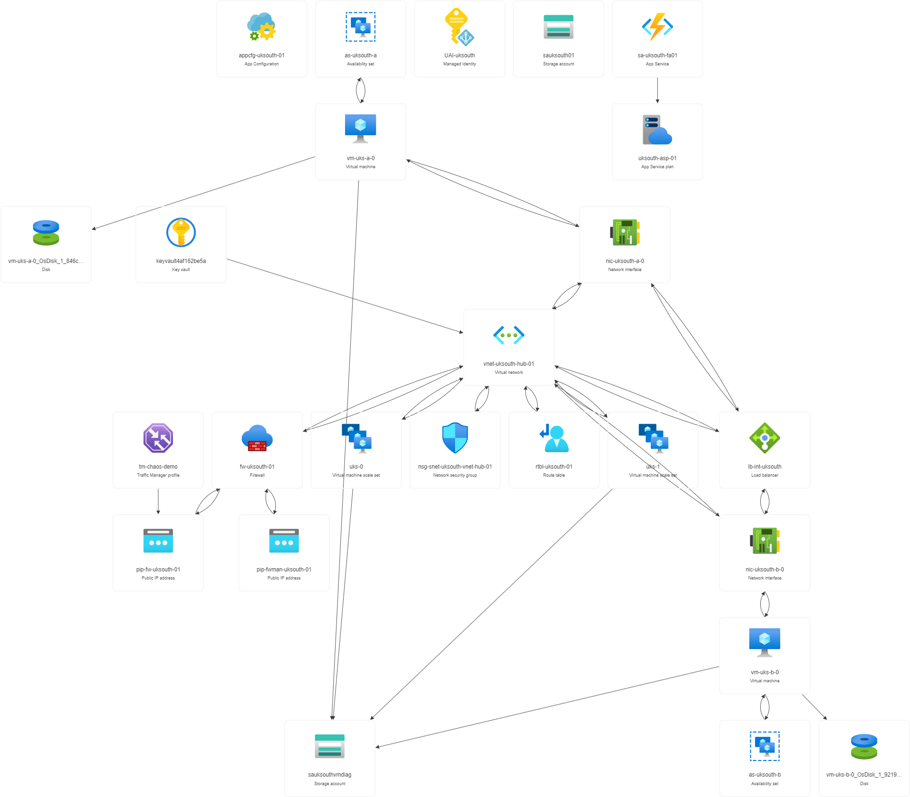

******************************************************************************* 
 
<b>PROJECT NAME:     ChaosStudioLab 
<b>CREATED BY:      THEANGRYTECH-GIT 
REPO:         https://github.com/theangrytech-git/ChaosStudioLab  
DESCRIPTION:</b>      This project will be used to deploy a small lab in UK South  
(UK West is optional as a failover for UK South, but can not be used for  
testing within Chaos Studio at this time), create 3 real-world PIR experiments,  
along with several individial small-scale experiments like Regional Outages,  
resource-type failures within a Region/Availability Set, etc.  
The aim of this repo is to help people become familiar with Chaos Studio by  
running these experiments, as well as creating their own to help test potential  
impact, failovers, Disaster Recovery plans at one level, and the Resilancy,  
Operational Excellence, and Performance Effeciency pillars of the  
Well-Architected Framework on a larger scale. 
 
******************************************************************************* 
 
 
 
******************************************************************************* 
                           <b>RESOURCE VISUALISATION</b> 
******************************************************************************* 
******************************************************************************* 
                             <b>HIGH LEVEL DESIGN</b> 
******************************************************************************* 
This section will be used to insert a High-Level Design to give an 
impression of how the Chaos Lab Solution is made up. 
******************************************************************************* 
 

